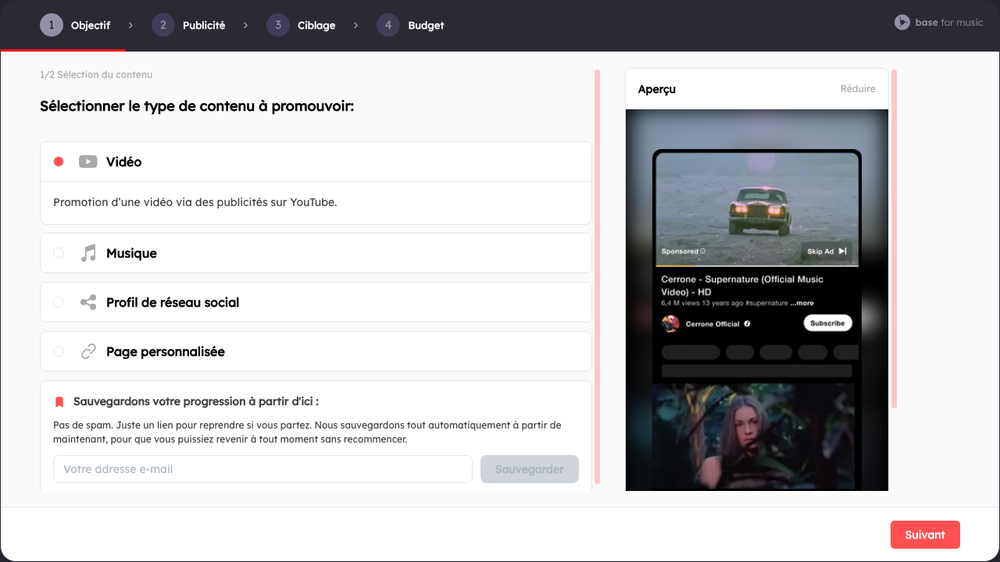

# B4M Widget Funnel

Embeddable widget SDK maintained by Base For Music. It provides a browser-ready bundle with auto-init support and a React wrapper so partners can drop the funnel in any project.



## Table of contents

- [Parameters](#parameters)
- [Quick start](#quick-start)
  - [Iframe embed (recommended)](#iframe-embed-recommended)
  - [Script loader (auto-init)](#script-loader-auto-init)
  - [React](#react)
  - [Manual mount (vanilla)](#manual-mount-vanilla)
- [Installation](#installation)
- [Development](#development)
- [Release workflow](#release-workflow)

## Parameters


The funnel supports 5 languages: `en`, `fr`, `de`, `es`, `pt`. Any other value falls back to `en`.

You can provide parameters in three ways:

- Script query string: `<script src="...baseformusic-widget.umd.js...&locale=fr&email=john@doe.com">`
- Data attributes on the mount container: `data-partner-id`, `data-locale`, `data-email`, `data-min-height`, `data-allow`, `data-src-base`
- Programmatic API: `window.B4MFunnel.mount(target, options)` or `<B4MFunnelReact ... />`

Parameters list:

- partnerId (required): your partner identifier.
- locale (optional): UI language. Supported: `en`, `fr`, `de`, `es`, `pt`. Defaults to `en` if omitted or invalid.
- email (optional): pre-fill contact email for the funnel.
- sidebar (optional): layout orientation of the sidebar. Accepted values: `horizontal`, `vertical`. Default: `vertical`.
- minHeight (optional): minimum height for the iframe container (e.g. `900px`, `720px`, or a number like `900`). Defaults to `900px`. Do not set less than `900px` — security default is `900px`.
- allow (optional): iframe `allow` permissions string. Defaults to `payment *; clipboard-read *; clipboard-write *; fullscreen *; autoplay; encrypted-media`.
- srcBase (optional): base URL of the funnel (default `https://funnel.baseformusic.com`).
- target / targetId / container (optional): id of the element where the widget should mount when using auto-init.

### Iframe parameters

If you embed the funnel directly as an iframe (without the loader), you can pass parameters in the query string too. Example:

```html
<iframe
  src="https://funnel.baseformusic.com/en/avWXB?email=artist@example.com"
  style="width: 100%; height: 900px; border: none"
></iframe>
```

Alternatively, if your integration prefers query-based locale/partner selection, the funnel also supports:

```html
<iframe
  src="https://funnel.baseformusic.com/en/avWXB?email=artist@example.com"
  style="width: 100%; height: 900px; border: none"
></iframe>
```

Sidebar examples:

- Horizontal Sidebar: `https://funnel.baseformusic.com/fr/slug-partner-id?sidebar=horizontal`
- Vertical Sidebar: `https://funnel.baseformusic.com/fr/slug-partner-id?sidebar=vertical` (default)

## Quick start

### Iframe embed (recommended)

Recommended for isolation and zero-JS integration:

```html
<iframe
  src="https://funnel.baseformusic.com/en/avWXB?email=artist@example.com"
  style="width: 100%; height: 900px; border: none"
></iframe>
```

### Script loader (auto-init)

We publish the UMD bundle on GitHub Pages, so you can load it directly:

```html
<div
  id="b4m-widget-funnel"
  data-partner-id="avWXB"
  data-locale="en"
  data-email="artist@example.com"
  data-sidebar="horizontal"
></div>
<!-- GitHub Pages (current latest) -->
<script src="https://b4m-tech.github.io/B4MFunnelReact/baseformusic-widget.umd.js"></script>
<!-- jsDelivr CDN (pinned) -->
<script src="https://cdn.jsdelivr.net/npm/b4m-widget-funnel@0.1.2/dist/baseformusic-widget.umd.js"></script>
<!-- UNPKG CDN (latest) -->
<script src="https://unpkg.com/b4m-widget-funnel/dist/baseformusic-widget.umd.js"></script>
```

To pin a specific release, use the versioned filename our pipeline generates (replace `0.1.0` with the relevant tag):

```html
<!-- Versioned GitHub Pages artifact -->
<script src="https://b4m-tech.github.io/B4MFunnelReact/baseformusic-widget.0.1.2.umd.js"></script>
<!-- Equivalent jsDelivr pin -->
<script src="https://cdn.jsdelivr.net/npm/b4m-widget-funnel@0.1.2/dist/baseformusic-widget.umd.js"></script>
```

You can also mount without a pre-existing container by passing parameters on the script URL (creates a container after the script):

```html
<script src="https://cdn.jsdelivr.net/npm/b4m-widget-funnel@0.1.2/dist/baseformusic-widget.umd.js?partnerId=avWXB&locale=fr&email=artist@example.com&sidebar=horizontal&minHeight=900px"></script>
```

### React

```tsx
import { B4MFunnelReact } from 'b4m-widget-funnel/react';

export function Demo() {
  return (
    <B4MFunnelReact
      partnerId="avWXB"
      locale="en"
      email="artist@example.com"
      sidebar="horizontal"
      minHeight="900px"
    />
  );
}
```

### Manual mount (vanilla)

```html
<div id="partner-widget"></div>
<script>
  window.B4MFunnel.mount('#partner-widget', {
    partnerId: 'avWXB',
    locale: 'en',
    email: 'artist@example.com',
    sidebar: 'horizontal',
    minHeight: '900px'
  });
  // window.B4MFunnel.unmount() to remove
</script>
```

## Installation

Install from npm (recommended):

```bash
npm install b4m-widget-funnel
```

Or straight from the GitHub repository (falls back to building from source):

```bash
npm install git+https://github.com/B4M-TECH/B4MFunnelReact.git#v0.1.2
```

> The package name is now `b4m-widget-funnel` (unscoped). Update the tag (`v0.1.2` or later) if installing from Git.

## Development

- `npm install`
- `npm run build` to generate the bundles in `dist/`
- React preview: `cd demo/react-sandbox && npm install && npm run dev`

## Release workflow

1. Update `CHANGELOG.md` (when available) and bump the version in `package.json`.
2. Run `npm run clean && npm run build` to refresh `dist/`.
3. Commit your changes and push to `main`.
4. Create a tag, e.g. `git tag v0.1.2 && git push origin v0.1.2`.
5. (Optional) Publish a GitHub release attaching the generated `docs/baseformusic-widget.0.1.2.umd.js` if you want a downloadable bundle.

Consumers can then run `npm install b4m-widget-funnel@0.1.2` or pin a Git commit/tag via `npm install git+https://github.com/B4M-TECH/B4MFunnelReact.git#v0.1.2`.
